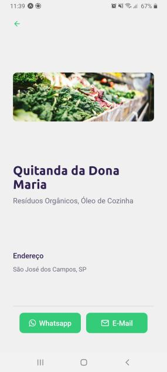
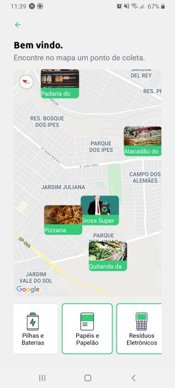
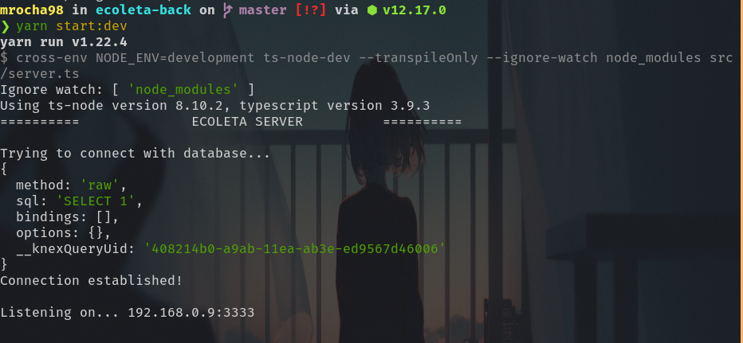

# Ecoleta ♻️🚀 (Back-End)


[](http://commitizen.github.io/cz-cli/)


Um marketplace de coleta de resíduos. Desenvolvido na primeira edição da Next Level Week da Rocketseat.

## 💼 Projeto

O Ecoleta foi criado durante a [Semana Mundial do Meio Ambiente (IBEW)](https://www.ibew.sg/), e tem como finalidade divulgar pontos de coleta de resíduos, como por exemplo, óleo de cozinha, pilhas, lâmpadas, e etc.

Confira uma prévia:

🌐 Web:


📱Mobile:




Para o back-end, foi utilizado:

- Typescript
- NodeJS v12.17
- Express
- Banco de dados Postgres
- Docker
- Heroku para deploy

## ⚙ Como rodar o back-end

Antes de tudo, instale os pré-requisitos:

- [Node](https://nodejs.org/dist/v12.17.0/)
- [Docker](https://docs.docker.com/get-docker/)
- [Docker Compose](https://docs.docker.com/compose/install/)
- [Yarn](https://classic.yarnpkg.com/pt-BR/docs/install#debian-stable)

Em seguida, execute os comandos:

```bash
git clone https://github.com/mrocha98/ecoleta-back #clona o repositório para sua máquina
cd ecoleta-back #entra no diretório do repositório
yarn install #instala as dependências
```

Agora é necessário que você crie um arquivo .env na raiz do projeto, e preencha com as informações do seu ambiente de desenvolvimento. Confira o arquivo [.env.example](https://github.com/mrocha98/ecoleta-back/blob/master/.env.example).

Após preencher, execute:

```bash
make up #sobe o container do banco de dados
# caso esse comando não funcione, utilize: docker-compose up
yarn run heroku-postbuild #executa as migrations e os seeds
yarn start:dev #executa a aplicação em modo de desenvolvimento
```

Se tudo ocorreu bem, você terá algo próximo disso em seu console:



## 🚀 Deploy

Para o deploy da API foi utilizada a plataforma Heroku. Não há restrição de cors, seu uso é livre.
`https://ecoleta-back.herokuapp.com/`

## 📜 Licença

Este projeto foi construído sob a licença BSD 2-Clause.
Clique [aqui](https://github.com/mrocha98/ecoleta-back/blob/master/LICENSE) para conferir mais detalhes.
